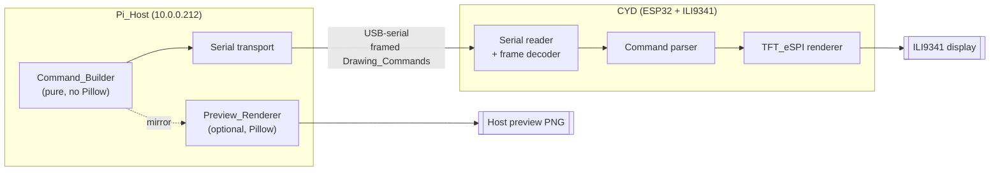
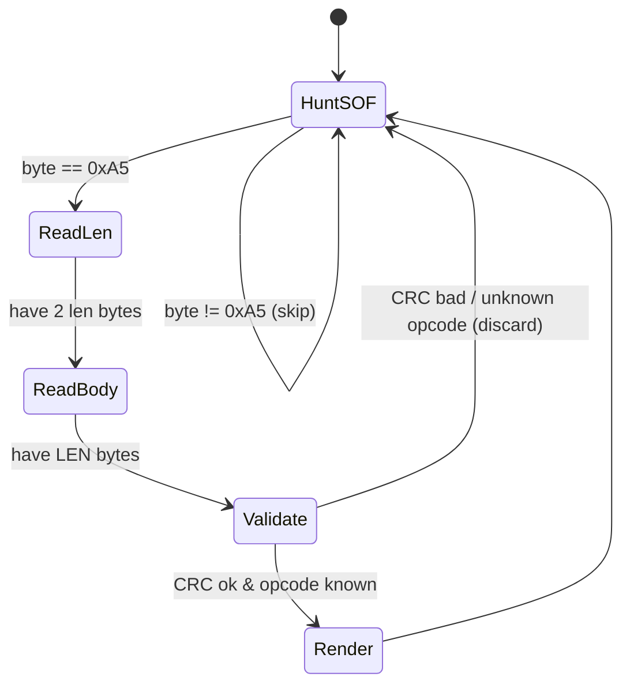
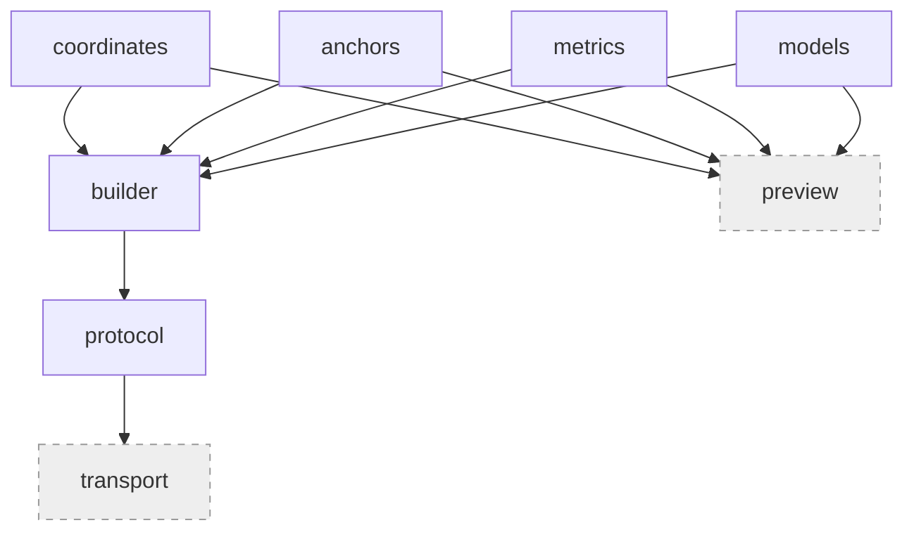
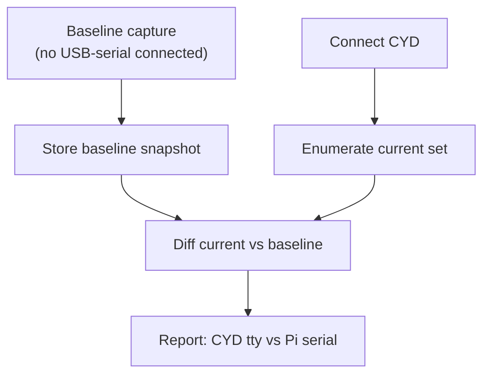

# Design Document: CYD Display Link

## Overview

CYD Display Link is a command-based display pipeline connecting a Raspberry Pi host
to a Cheap Yellow Display (CYD, an ESP32 board with an ILI9341 TFT) over USB-serial.
The host builds high-level `Drawing_Command` objects (draw text, draw rectangle),
serializes them into a compact framed byte stream, and transmits them over the serial
link. Custom firmware on the CYD parses each complete command and renders it locally
with TFT_eSPI. This is a command protocol, never framebuffer streaming.

The system has three parts:

1. **CYD_Firmware** — C++ (Arduino framework + TFT_eSPI) targeting ESP32/ILI9341.
2. **Host_Library** — a uv-managed Python package rooted at `whiskerframe/`, providing
   a pure `Command_Builder` (anchor/coordinate/geometry math and serialization, no
   Pillow) and an optional Pillow-based `Preview_Renderer` mirroring the imagesmacker
   7.0.0 drawing model.
3. **Tooling workflows** — device discovery, Pi connectivity/environment verification,
   and an irreversible-flash safety gate.

The drawing API mirrors [imagesmacker 7.0.0](https://github.com/whinee/imagesmacker/tree/main/docs/api/7.0.0):
a 2-character anchor model (`[lmr][tmb]`), rectangle coordinate representations
(XYXY / XYWH / FourXY), and multiline text layout.

## Architecture

### System topology



### Data flow

```mermaid
sequenceDiagram
    participant App as Host app / test
    participant CB as Command_Builder
    participant Ser as Serializer
    participant Link as USB-serial
    participant FW as CYD_Firmware
    participant TFT as ILI9341

    App->>CB: draw_text(rect, "hi", anchor="mm")
    CB->>CB: resolve anchor -> (x, y) placement
    CB->>Ser: DrawText payload
    Ser->>Link: [SOF][len][opcode][payload][crc]
    Link->>FW: bytes
    FW->>FW: accumulate until complete frame
    alt frame valid
        FW->>TFT: render text at anchor
    else unparseable
        FW->>FW: discard, continue (Req 1.4)
    end
```

The command path is strictly high-level: the host never embeds a framebuffer or full
bitmap in the serial stream (Req 1.5). Placement math is computed host-side by
`Command_Builder`; the firmware receives resolved anchors/coordinates and draws.

## Serial Protocol

### Framing

The wire format uses explicit length framing so the firmware can detect a complete
command before parsing, and can resynchronize after corruption. Every frame:

```text
+-------+--------+--------+---------------------+--------+
| SOF   | LEN    | OPCODE | PAYLOAD (LEN-1 B)   | CRC8   |
| 0xA5  | uint16 | uint8  | opcode-specific     | uint8  |
+-------+--------+--------+---------------------+--------+
```

- **SOF** (`0xA5`): start-of-frame marker for resynchronization.
- **LEN** (`uint16`, little-endian): number of bytes in `OPCODE + PAYLOAD`
  (i.e. `1 + len(payload)`). Bounds the frame; firmware waits until `LEN` bytes arrive.
- **OPCODE** (`uint8`): command selector (below).
- **PAYLOAD**: opcode-specific, fixed-layout, little-endian integers, UTF-8 for text.
- **CRC8** (`uint8`): CRC-8 over `OPCODE + PAYLOAD` for integrity.

Multi-byte integers are little-endian to match the ESP32. Colors are RGB565
(`uint16`) to match the ILI9341 native pixel format.

### Opcodes

| Opcode | Name          | Purpose                                |
| ------ | ------------- | -------------------------------------- |
| `0x01` | `DRAW_TEXT`   | Render text at a resolved anchor point |
| `0x02` | `DRAW_RECT`   | Render a rectangle (outline or filled) |
| `0x10` | `CLEAR`       | Clear the display to a fill color      |
| `0x1F` | `FLUSH`       | Marker/no-op for batch boundaries      |

The minimum required set is `DRAW_TEXT` and `DRAW_RECT` (Req 1.3). `CLEAR` and `FLUSH`
are reserved and defined for completeness; they are not part of the required surface.

### Payload encodings

`DRAW_TEXT` (opcode `0x01`):

```text
x        : uint16   resolved anchor x (px)
y        : uint16   resolved anchor y (px)
anchor   : uint8    packed anchor: high nibble h in {0=l,1=m,2=r}, low nibble v in {0=t,1=m,2=b}
color    : uint16   RGB565 foreground
bg_color : uint16   RGB565 background (used when inverted)
font_size: uint8    text size / font selector
flags    : uint8    bit0 inverted, bit1 multiline
line_h   : uint16   line height in px (multiline)
text_len : uint16   UTF-8 byte length
text     : bytes    UTF-8 text (LF-separated lines when multiline)
```

`DRAW_RECT` (opcode `0x02`):

```text
x      : uint16   resolved top-left x (px)
y      : uint16   resolved top-left y (px)
w      : uint16   width (px)
h      : uint16   height (px)
color  : uint16   RGB565
flags  : uint8    bit0 filled (else outline)
```

The host resolves the anchor to concrete pixel coordinates before serialization, so
the firmware draws from resolved values; the `anchor` byte in `DRAW_TEXT` tells the
firmware how to align the text box relative to `(x, y)` (TFT_eSPI datum), preserving
the imagesmacker anchor semantics on-device.

### Discard-on-unparseable (Req 1.4)

The firmware maintains a byte accumulator and a small state machine:



On CRC mismatch, unknown opcode, or a `LEN` exceeding the receive buffer, the frame is
discarded and the reader returns to `HuntSOF`, so subsequent commands continue to be
processed (Req 1.4). A `LEN` cap (e.g. 2 KB) bounds buffer use and rejects runaway
frames.

## CYD Firmware (C++ / Arduino / TFT_eSPI)

Firmware lives under `firmware/cyd_display_link/` (PlatformIO/Arduino sketch layout).

### Responsibilities

- On boot: initialize `TFT_eSPI` for ILI9341, set rotation, clear screen, and begin
  `Serial` at a fixed baud (Req 2.2).
- Continuously read serial bytes into the frame decoder.
- On a valid `DRAW_TEXT`: set text datum from the packed anchor, set color/size, and
  render text (handling multiline by splitting on LF and advancing by `line_h`) (Req 2.3).
  If the text anchor/coordinates would place the text outside the visible display
  bounds, or parameters are invalid, skip rendering that `DRAW_TEXT` entirely — no
  clipping or placement adjustment (Req 2.5). The frame itself is still consumed
  normally, distinct from the unparseable-frame discard path.
- On a valid `DRAW_RECT`: draw filled or outline rectangle (Req 2.4).

### Module sketch

```cpp
// frame.h  — decoder state machine + CRC8
class FrameDecoder {
 public:
  // Feed one byte; returns true when a complete, CRC-valid frame is ready.
  bool feed(uint8_t b);
  uint8_t opcode() const;
  const uint8_t* payload() const;
  uint16_t payload_len() const;
};

// render.h  — TFT_eSPI drawing
void render_text(TFT_eSPI& tft, const uint8_t* payload, uint16_t len);
void render_rect(TFT_eSPI& tft, const uint8_t* payload, uint16_t len);

// main.cpp
void setup();  // tft.init(); tft.setRotation(...); Serial.begin(BAUD);
void loop();   // while (Serial.available()) if (dec.feed(Serial.read())) dispatch();
```

The anchor byte maps directly onto TFT_eSPI text datums (`TL_DATUM`, `MC_DATUM`,
`BR_DATUM`, …), so on-device alignment matches host-computed placement.

## Drawing API (Host_Library, imagesmacker 7.0.0 model)

### Anchor and coordinate model

- **Anchor**: a 2-character string `[lmr][tmb]` (horizontal in `l/m/r`, vertical in
  `t/m/b`), default `"mm"` — identical to imagesmacker's
  `Literal['lt','mt','rt','lm','mm','rm','lb','mb','rb']`.
- **Coordinates**: rectangle regions expressible as `XYXY`, `XYWH`, or `FourXY`, all
  convertible to a canonical bounding box and exposing `anchor_coordinates(anchor)`
  returning the `(x, y)` pixel for that anchor — mirroring
  `imagesmacker.models.coordinates.RectangleCoordinates`.
- **Placement**: `Command_Builder` calls `anchor_coordinates` to resolve where content
  is pinned, then serializes resolved coordinates (Req 3.1, 3.4).

Anchor resolution (pure integer math, no Pillow):

```text
x = {l: x1, m: (x1+x2)//2, r: x2}[anchor[0]]
y = {t: y1, m: (y1+y2)//2, b: y2}[anchor[1]]
```

### Multiline text layout

For multiline text, `Command_Builder` splits on `\n`, measures each line against the
configured font metrics table (a static width/height table shipped with the library,
so no Pillow is needed on the command path), stacks lines by `line_height`, and
computes the block's anchor origin. The `inverted` flag reverses line order and swaps
fg/bg, matching imagesmacker's `inverted` semantics (Req 3.3, 8.3). This is exactly the
behavior the `text_anchors_inverted_multiline.py` test exercises.

### Public API surface (`whiskerframe/`)

```text
whiskerframe/
  __init__.py            # re-exports: XYXY, XYWH, FourXY, Anchor,
                         #   TextStyle, DrawText, DrawRect, CommandBuilder, serialize
  coordinates.py         # RectangleCoordinates ABC + XYXY / XYWH / FourXY,
                         #   XY/WH named tuples, anchor_coordinates()
  anchors.py             # Anchor type, validate_anchor(), resolve_anchor()
  models.py              # pydantic: TextStyle, TextConfig, RectConfig, DrawText, DrawRect
  metrics.py             # static font metrics table (pure; no Pillow) for text sizing
  builder.py             # CommandBuilder: draw_text(), draw_rect(), multiline layout
  protocol.py            # frame constants, opcodes, crc8, serialize()/frame()
  transport.py           # SerialTransport (pyserial) — send(frame); optional import
  preview.py             # Preview_Renderer (Pillow) — optional import guarded
```

Key entry points:

```python
class CommandBuilder:
    def draw_text(
        self,
        coords: RectangleCoordinates,
        text: str,
        *,
        anchor: Anchor = "mm",
        style: TextStyle | None = None,
        multiline: bool = False,
        line_height: int | None = None,
        inverted: bool = False,
    ) -> DrawText: ...

    def draw_rect(
        self,
        coords: RectangleCoordinates,
        *,
        anchor: Anchor = "lt",
        color: int = 0xFFFF,
        filled: bool = False,
    ) -> DrawRect: ...

def serialize(command: DrawText | DrawRect) -> bytes:  # framed bytes, no Pillow
    ...
```

`Preview_Renderer` is imported lazily; `Command_Builder`, `serialize`, and
`SerialTransport` never import Pillow, so the command path runs without it installed
(Req 3.2, 4.3). When a `Preview_Renderer` function is invoked while Pillow is not
installed, the guarded import raises a clear error naming the missing Pillow
dependency; `Command_Builder` stays fully operable in that state (Req 4.4).
`Preview_Renderer.render(commands) -> PIL.Image` reuses the same
`coordinates.py`/`anchors.py`/`metrics.py` placement math so preview and device agree
(Req 4.1, 4.2, 8.4).

`Command_Builder` mirrors the imagesmacker 7.0.0 API in strict parity: the
`anchor`, coordinate (`XYXY`/`XYWH`/`FourXY`), and multiline-text signatures and
behavior match imagesmacker 7.0.0 exactly, not merely by analogous concept (Req 8.4).
If a computed placement is inconsistent with the imagesmacker 7.0.0 model,
`Command_Builder` rejects the `Drawing_Command` and surfaces an error to the caller,
producing no fallback or approximate placement (Req 3.5).



## Tooling Workflows

Tooling scripts live under `scripts/` and are documented for operator use.

### Device_Discovery



Enumeration sources (Req 5.1): `lsusb`, and globbed `/dev/ttyUSB*`, `/dev/ttyACM*`,
`/dev/serial/by-id/`. A Baseline used for a diff is valid only if it was captured with
no USB-serial device connected; the workflow does not itself mandate a capture, it
constrains when a Baseline counts as valid input to the diff (Req 5.2). Running with the CYD attached diffs current against baseline (Req 5.3); the
newly-appeared serial node is reported as the CYD, while the Pi's built-in serial
(present in the baseline) is reported as Pi serial (Req 5.4). `/dev/serial/by-id/`
symlinks are preferred in the report because they are stable across reboots.

### Pi connectivity and environment verification

- Connect over SSH to `10.0.0.212` as `root` using key `/home/lyra/.ssh/id_rsa`
  (Req 6.1). The key is referenced by path only; its contents are never read or logged.
- Verify `python3`, `pip`, and `pyserial` on the Pi (Req 6.2) via
  `python3 --version`, `pip --version`, `python3 -c "import serial"`.
- Any missing component is reported by name (Req 6.3); the check is read-only and makes
  no changes to the Pi.

### Flash safety gate (irreversible-action gate)

Flashing the CYD is irreversible: writing overwrites the factory firmware. This gate is
a hard precondition on every write.

```mermaid
flowchart TD
    START([Write/flash requested]) --> HASBK{Validated backup<br/>exists?}
    HASBK -- no --> BK["esptool.py read_flash 0x0 0x400000 backup.bin<br/>(explicit size)"]
    BK --> V{File exists AND<br/>size == 0x400000 (non-zero)?}
    V -- no --> ABORT[[ABORT — block all writes]]
    V -- yes --> CONF
    HASBK -- yes --> CONF{Explicit user<br/>confirmation?}
    CONF -- no --> ABORT
    CONF -- yes --> SZ{Every esptool op has<br/>explicit valid size?}
    SZ -- no --> ABORT
    SZ -- yes --> WRITE["Proceed with write/flash"]
```

Rules enforced:

- Before any write, create `Flash_Backup` by reading the full flash with an **explicit**
  size `0x400000` (Req 7.1).
- Every `esptool.py` read and write specifies an explicit flash size; `ALL`,
  unspecified, or invalid sizes are rejected (Req 7.2).
- After backup, validate the file exists and its size equals `0x400000` and is non-zero
  (Req 7.3).
- If the backup is missing or the size does not match, abort before any write (Req 7.4).
- Require explicit user confirmation before any write (Req 7.5).
- While no validated backup exists, block all writes/flashes (Req 7.6).

This gate is documented in `docs/api/unreleased/ai-decisions.md` as an irreversible
action requiring human confirmation.

## Packaging

The current `pyproject.toml` is inconsistent: `project.name = "src"`,
`tool.setuptools.packages.find.include = ["imagesmacker*", ...]`, but the real source
directory is `whiskerframe/`. The build therefore targets a non-existent package.

Resolution (Req 12.3, 13.1–13.3):

```toml
[project]
name = "whiskerframe"
requires-python = ">=3.12"

[tool.setuptools.packages.find]
include = ["whiskerframe*"]

[project.optional-dependencies]
preview = ["pillow>=10"]
serial = ["pyserial>=3.5"]
```

- Project name becomes `whiskerframe`, consistent with the source directory (Req 13.1).
- Package discovery targets `whiskerframe*` instead of `src`/`imagesmacker` (Req 13.2).
- A build then includes the `whiskerframe` package (Req 13.3).
- Pillow and pyserial are optional extras so the pure command path installs without them
  (Req 4.3).
- uv-managed with `requires-python >=3.12` (Req 12.1); ruff/black/mypy strict retained,
  with mypy `strict = true` (Req 12.2). Stale `src.egg-info` / `imagesmacker.egg-info`
  are removed as temp artifacts per the delete-temp-files rule.

## Testing Strategy

Tests validate the pure `Command_Builder` math with no hardware and no Pillow, by
exercising anchor resolution, coordinate conversion, and multiline stacking, then
asserting on serialized bytes and resolved coordinates.

### Test scripts (`test/`) — Req 9

- `text_anchors.py`: for each of the nine anchors, build a `DRAW_TEXT` over a known
  rectangle and assert the resolved `(x, y)` equals the analytically expected anchor
  point, and that the framed bytes round-trip through a decode helper.
- `text_anchors_multiline.py`: multiline block over a rectangle; assert per-line origins
  are stacked by `line_height` and the block anchor matches expectation.
- `text_anchors_inverted_multiline.py`: same as multiline with `inverted=True`; assert
  line order reversed and fg/bg swapped in the payload.

### Example scripts (`examples/`) — Req 10

- `01_coordinates.py`: construct `XYXY`/`XYWH`/`FourXY`, show conversions and
  `anchor_coordinates`.
- `02_text.py`: build and serialize a single `DRAW_TEXT`.
- `03_multiline_text.py`: build and serialize a multiline `DRAW_TEXT`.

### Justfile recipes — Req 11

```just
test:
    python test/text_anchors.py
    python test/text_anchors_multiline.py
    python test/text_anchors_inverted_multiline.py

examples:
    python examples/01_coordinates.py
    python examples/02_text.py
    python examples/03_multiline_text.py
```

### Hardware-free rationale

Because placement is pure integer math and serialization is deterministic, tests assert
against a decode helper (`protocol.decode(frame) -> command`) — a round-trip — and
against analytically-derived anchor coordinates. No serial port, no ESP32, no Pillow.
Property tests (below) generalize the anchor/coordinate/round-trip invariants.

## Design Decisions / Rationale

- **Command protocol, not framebuffer.** Sending high-level commands keeps the serial
  link small and pushes rendering to the CYD, satisfying Req 1.5 and matching the
  hardware's TFT_eSPI capabilities.
- **Length-prefixed framing + CRC8.** Explicit `LEN` lets the firmware know when a
  command is complete before parsing; CRC8 + SOF resync give clean discard-and-continue
  behavior (Req 1.4) on a noisy USB-serial link, at minimal overhead.
- **RGB565 + little-endian on the wire.** Matches ILI9341 pixel format and ESP32
  endianness, avoiding conversion on the constrained device.
- **Host resolves anchors.** Anchor→pixel math happens on the Pi so the firmware stays
  simple; the anchor byte is still sent so TFT_eSPI text datum alignment is exact.
- **Static font-metrics table for the pure path.** Multiline sizing needs glyph metrics;
  shipping a static table avoids a Pillow dependency on the command path (Req 3.2, 4.3)
  while the Pillow `Preview_Renderer` reuses the same placement modules for parity.
- **Optional extras for Pillow/pyserial.** Keeps the command builder importable in
  minimal environments and on the Pi.
- **Package rename to `whiskerframe`.** Removes the `src`/`imagesmacker` mismatch so the
  build targets the real source tree (Req 13).
- **Flash gate as a hard, human-confirmed precondition.** Firmware writes are
  irreversible; explicit-size backup + validation + confirmation prevents unrecoverable
  loss (Req 7). Documented in `ai-decisions.md`.

All notable decisions are recorded in `docs/api/unreleased/ai-decisions.md`; the changelog
`docs/dev/changelog.md` unreleased section tracks API additions per the changelog rule.

## Requirements Traceability

| Requirement | Design coverage |
| ----------- | --------------- |
| 1.1 | `protocol.serialize()` framing |
| 1.2 | Firmware frame decoder → dispatch → render |
| 1.3 | `DRAW_TEXT` (`0x01`) + `DRAW_RECT` (`0x02`) opcodes |
| 1.4 | Decoder state machine discard-on-invalid |
| 1.5 | High-level opcodes; no bitmap in payload |
| 2.1 | C++ Arduino + TFT_eSPI, ESP32/ILI9341 firmware |
| 2.2 | `setup()` init display + `Serial.begin` |
| 2.3 | `render_text` with anchor datum + multiline |
| 2.5 | `render_text` bounds/validity check → skip entirely |
| 2.4 | `render_rect` filled/outline |
| 3.1, 3.4 | `anchor_coordinates` resolution in builder |
| 3.5 | Builder rejects placement inconsistent with imagesmacker 7.0.0; no fallback |
| 3.2 | Pure path; Pillow lazily imported only in `preview.py` |
| 3.3 | Multiline layout in `builder.py` |
| 4.1, 4.2 | `Preview_Renderer` reusing shared placement modules |
| 4.3 | Pillow/pyserial as optional extras |
| 4.4 | Guarded Pillow import raises clear error; builder stays operable |
| 5.1–5.4 | `Device_Discovery` enumerate + baseline diff + report |
| 6.1–6.3 | Pi SSH connect + python3/pip/pyserial checks |
| 7.1–7.6 | Flash safety gate flow |
| 8.1–8.3 | `draw_text`/`draw_rect`/multiline modeled on imagesmacker |
| 8.4 | Strict parity with imagesmacker 7.0.0 API signatures + behavior |
| 9.1–9.3 | `test/` scripts |
| 10.1–10.3 | `examples/` scripts |
| 11.1, 11.2 | justfile `test` / `examples` recipes |
| 12.1–12.3 | uv, py>=3.12, ruff/black/mypy strict, `whiskerframe/` |
| 13.1–13.3 | `pyproject` name + discovery targeting `whiskerframe` |

## Correctness Properties

*A property is a characteristic or behavior that should hold true across all valid
executions of a system-essentially, a formal statement about what the system should do.
Properties serve as the bridge between human-readable specifications and
machine-verifiable correctness guarantees.*

### Property 1: Serialization round trip

*For any* valid `DrawText` or `DrawRect` command, decoding the framed bytes produced by
`serialize(command)` yields a command equal to the original.

**Validates: Requirements 1.1**

### Property 2: Command payload is not a framebuffer

*For any* valid `DrawText` or `DrawRect` command, the serialized frame length is far
below a full-display bitmap size (320 × 240 × 2 bytes), i.e. the serial path carries no
full framebuffer.

**Validates: Requirements 1.5**

### Property 3: Decoder recovers all valid frames and discards the rest

*For any* byte stream formed by interleaving valid frames with arbitrary corrupted or
garbage bytes, the frame decoder emits exactly the valid frames in their original order
and discards everything else.

**Validates: Requirements 1.4**

### Property 4: Anchor resolution matches the imagesmacker model

*For any* rectangle (expressed as XYXY, XYWH, or FourXY) and *any* 2-character anchor in
`[lmr][tmb]`, `anchor_coordinates(anchor)` returns the pixel point given by the
horizontal key mapping to left/center/right and the vertical key mapping to
top/middle/bottom of the rectangle's bounding box.

**Validates: Requirements 3.1, 3.4, 8.1, 8.2**

### Property 5: Multiline layout stacks lines by line height under the block anchor

*For any* multiline text and *any* anchor and line height, the resolved per-line origins
are evenly spaced by the line height and the overall block is positioned so its anchor
point coincides with the anchor point of the target rectangle; enabling `inverted`
reverses line order and swaps foreground and background.

**Validates: Requirements 3.3, 8.3**

### Property 6: Preview placement mirrors builder placement

*For any* valid command, the placement coordinates computed by the `Preview_Renderer`
equal the coordinates resolved by the `Command_Builder`.

**Validates: Requirements 4.2, 8.4**

### Property 7: Flash-backup validation accepts only the exact flash size

*For any* candidate backup file, validation succeeds if and only if the file exists and
its size equals `0x400000` (and is therefore non-zero).

**Validates: Requirements 7.3**

### Property 8: No flash write without a validated backup, explicit size, and confirmation

*For any* sequence of operations issued to the flash gate, a write or flash operation
proceeds only when a validated `Flash_Backup` exists, the operation specifies an explicit
valid flash size, and explicit user confirmation has been given; otherwise the write is
blocked.

**Validates: Requirements 7.2, 7.4, 7.5, 7.6**

### Property 9: Device diff equals the set difference against the baseline

*For any* baseline device set and *any* current device set, the `Device_Discovery` diff
reports exactly the devices present in the current set but absent from the baseline as
added, and those absent from the current set as removed.

**Validates: Requirements 5.3**

### Property 10: Environment check reports exactly the missing components

*For any* combination of presence flags over {python3, pip, pyserial}, the connectivity
workflow reports exactly the components that are absent.

**Validates: Requirements 6.3**
